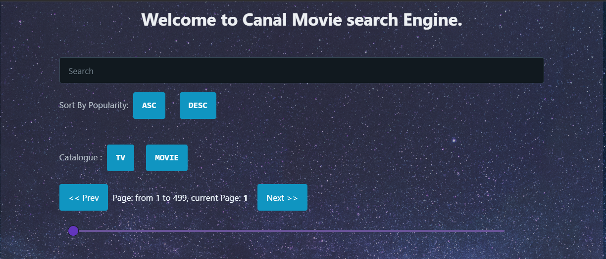

# Canal Movie Front

this project is a frontend App for [themoviedb](https://developers.themoviedb.org/3/movies/get-movie-videos) website

this project is a frontend App for [themoviedb](https://developers.themoviedb.org/3/movies/get-movie-videos) website

## Table of contents

- [General info](#general-info)
- [Overview](#overview)
- [In search](#in-search)
- [Components](#components)
  - [CustomHook](#custom-hooks)
- [Services](#services)
- [Available Scripts](#available-scripts)

## General info

By default i use discovery request to find all TV or Movie content and apply a search, sort, paginate module in it.  
there is a search mode, which use MultiSearch EndPoint to find all Movie and TV content  
**NB:**

> sorting in not allowed by API in Search Mode.  
> Api is limited to Maximum 500 pages results.

there is a Detail Mode, to find out more of single content with some couple detail.

`In case if search Word is empty we set discovery mode TV by default.`

### In Discovery

**_in deiscovery mode we can't have both TV and movie content in same time, this is why I choice select TV content by default._**

### Pagination Module

pagination module is base Page result, it apply dynamically paginate when page content updating.

### In search

handle query params and it set page to 1 before search.

## Overview

### Components

We have some BaseComponents

- List : to display all Results with image and name.
- Sort : Sorting popularity desc or asc and handle QueryParams  
  http://localhost:3000/asc  
  http://localhost:3000/desc

- Paginate : base on the returned, result return range to paginate and handle currentposition Change.
- Search : text input with debouce to fire changeEnvent and updata content.

we have Layout And Page Contents.

- we have some Layouting systems as component to organise display area, in this project i use V5layout.
- SeachPage: Compose multiple component to make search page, with Using Fetching Service to get data.
- DetailPage: to display view of a single component.

### Custom hooks

- useDeouceHook. it is a hook to handle delay and word distinction before fire event, Base on Rxjs.

### Services

FilmService handle data fetching by Category and serching query.

### Available Scripts

#### `npm start`

The page will reload if you make edits.\
You will also see any lint errors in the console.

#### `npm test`

Launches the test runner in the interactive watch mode.\

#### `npm run build`

Builds the app for production to the `build` folder.\

#### `npm run eject`
